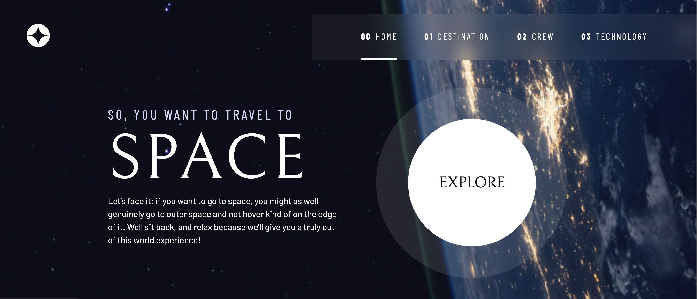

# Frontend Mentor - Space tourism website

This is a solution to the [- Space tourism website challenge on Frontend Mentor](https://www.frontendmentor.io/challenges/space-tourism-multipage-website-gRWj1URZ3). Frontend Mentor challenges help you improve your coding skills by building realistic projects. 

## Table of contents

  - [The challenge](#the-challenge)
  - [Links](#links)
  - [Built with](#built-with)
  - [Continued development](#continued-development)
  - [Useful resources](#useful-resources)

## Overview

### The challenge

The challenge is to build out this multi-page space tourism website and get it looking as close to the design as possible.

### Screenshot

### Links

- [Live demo](https://jeraldinnemg.github.io/space-travel/)

## My process

### Built with

I follow the entire way how Kevin Powdell would tackle the project, you can [check this out](https://scrimba.com/learn/spacetravel)

### Continued development

I'm a junior exploring technologies so I think there are a lot of ways to get the result! With this project I got more confidence writting CSS.

